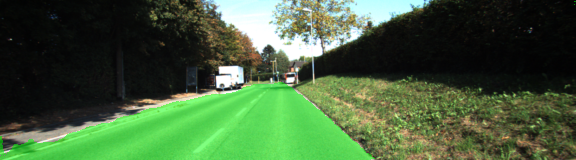
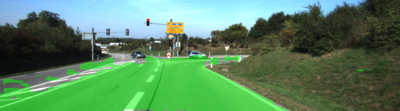

# road-segmentation-on-collab
Road Segmentation on Kitti Road dataset

 
 
  Example Predictions

## Run
Upload all files to Google Drive in a folder named "road-segmentation-on-colab" (without quotes) and run semgent_road.ipynp on colab.

### Dataset
Notebook downloads dataset automatically but you can find dataset [here](http://www.cvlibs.net/download.php?file=data_road.zip) too. (must be in a folder named "data"
More info [Kitti Road dataset](http://www.cvlibs.net/datasets/kitti/eval_road.php) 

